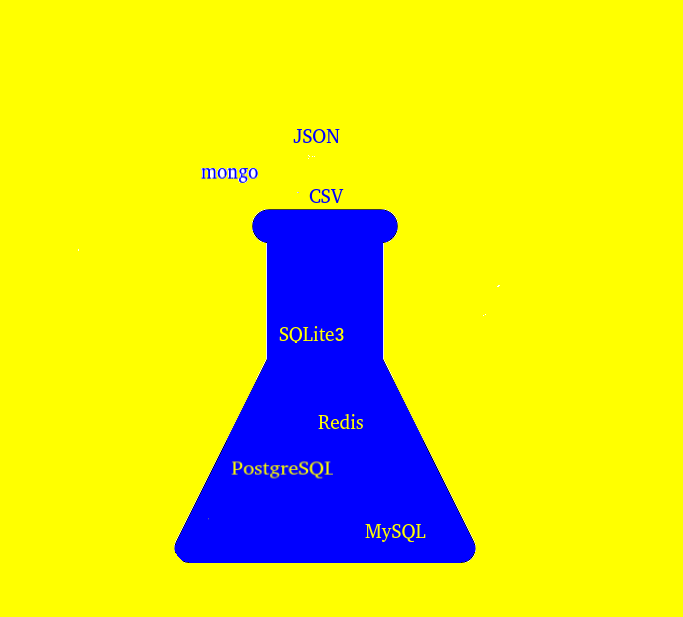
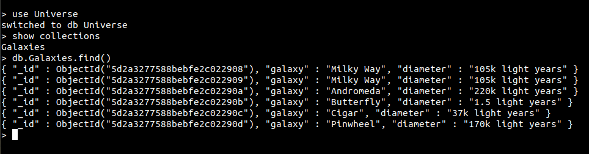
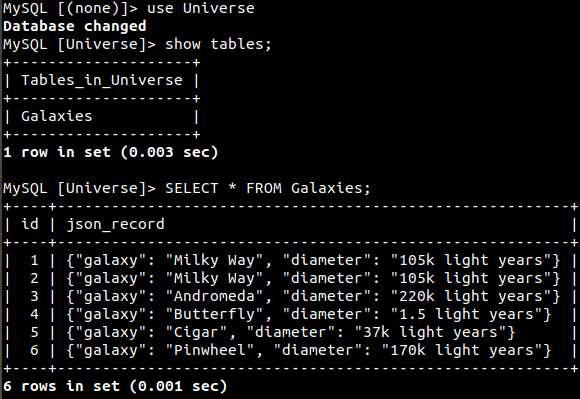
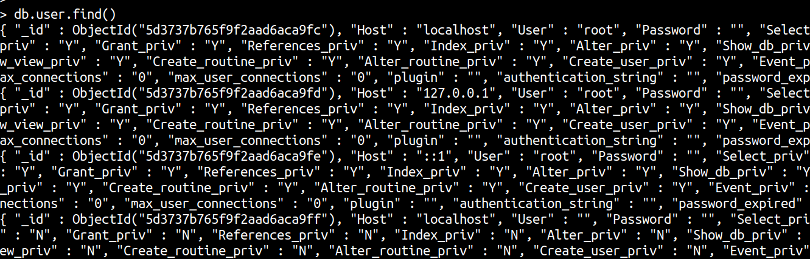

# DataFleaker     

## DataFleaker - Instantly Convert Results Sets Mongo DB to MySQL DB or Maria DB and Vice Versa.

## Prototype Development Brief
This is currently a prototype in development that I started developing due to my interest in determing the flexibility
of converting different results sets from specific DB management systems to different DB management systems on the fly
such as NoSQL and Relational based databases. The concept is nothing new in terms of ETL but is worth exploring the 
capabilties and feasbilties involved which is what this prototype intends to capture.

## Description
The purpose of DataFleaker is to convert specific database result sets to other database result sets for different
database management systems. This allows developers the flexibility to use the additional services(SQL and Javascript 
for query,Replication, etc)  provided by different database management systems that other database management systems 
may lack. For example, converting a result set return by a NoSQL DB such as
Mongo which is in JSON format directly into a MySQL/MariaDB Database on the fly. Then using SQL and built in JSON api's
in MySQL/MariaDB to query this new result set from the newly created DB. Or converting a MySQL/MariaDB result set to a 
Mongo DB result set and using  the capabilities of the Mongo DB management system such as the built in JavaScript 
capabilties for query and searching. 

## Early Prototype Features:
    * Current support for creating specific Class Objects for MongoDB, MySQLDB, MariaDB and SQLite3.
      This allows specific DB class objects to be passed into the DataFleaker for data result sets to be
      converted on the fly through one of the DataFleakers member APIs.
    * Current support for connecting to MongoDB, MySqlDB, MariaDB, and SQLite3 through the object instances.
    * Current support for executing basic queries(DB Creation, Tables/Collections, and simple queries)
      on MongoDB, MySQLDB, MariaDB, and SQLite3. Note these are early implemenations so there is no 
      error checks for specific conditions etc... In other words this is no where near production code.
    * Current support for converting a MongoDB result set(JSON format) to a New DB with JSON Type field
      in MySQL/MariaDB. Note this is early work and the current conversion is a very basic SQL insert 
      operation, not optimized for speed and different DB engine types. 
    * New support for converting simple result MariaDB queries to MongoDB. 
      See examples/ConvertMariaDBResult_To_MongoDB.py
    * Added bulk insert capability for MongoDB to MySQL/Maria DB.
      
 ## Tested with:
    * python3
    * pip3 install mysql-connector-python
    * XAMPP 7.3.6 - Running 10.3.16-MariaDB
    * MongoDB - Running v4.0.10
    * Linux Distro: 
        Ubuntu 18.04.2 LTS
        4.15.0-54-generic #58-Ubuntu SMP Mon Jun 24 10:55:24 UTC 2019
        x86_64 x86_64 x86_64 GNU/Linux
    
## Get Started:
    ~/Development/python/workroot$ git clone git@github.com:planckbit/DataFleaker.git
    ~/Development/python/workroot$ cd DataFleaker
    ~/Development/python/workroot/DataFleaker$ PYTHONPATH=~/Development/python/workroot/DataFleaker
    ~/Development/python/workroot/DataFleaker$ export PYTHONPATH
    ~/Development/python/workroot/DataFleaker$ cd examples/
    ~/Development/pythong/workroot/DataFleaker/examples$ chmod 755 ConvertMongoDBResult_To_MySqlDB.py
    ~/Development/python/workroot/DataFleaker/examples$ ./ConvertMongoDBResult_To_MySqlDB.py
   
   Example-1: Simple  MongoDB query result Converted to Mysql DB.
     
    from DatabaseClass import DatabaseClass
    from MySQLClass import MySQLClass
    from MariaDBClass import MariaDBClass
    from MongoDBClass import MongoDBClass
    from DataFleakerClass import DataFleakerClass

    mongoServerAddress = "mongodb://localhost:27017"
    dbName = "Universe"
    collectionTableName = "Galaxies"
    dictRecord = {"galaxy": "Milky Way", "diameter": "105k light years"}

    listRecords = [{"galaxy": "Milky Way", "diameter": "105k light years"},
                   {"galaxy": "Andromeda", "diameter": "220k light years"},
                   {"galaxy": "Butterfly", "diameter": "1.5 light years"},
                   {"galaxy": "Cigar", "diameter": "37k light years"},
                   {"galaxy": "Pinwheel", "diameter": "170k light years"}]

    # Initial MySQL DB Connection Instance.
    mySqlDBClassInstance = MySQLClass("localhost", "root", "")
    # Connect to Mysql, but select no DB.
    mySqlDBClassInstance.mysqlConnect()

    # Create Mongo DB Universe , Collection Galaxies, and Add one record for creation.
    mongoDBClassInstance = MongoDBClass(mongoServerAddress)
    mongoDBClassInstance.mongoConnectDataBase(dbName)
    mongoDBClassInstance.mongoInsertOneRecord(collectionTableName, dictRecord)
    # Insert a few records.
    mongoDBClassInstance.mongoInsertManyRecords(collectionTableName, listRecords)

    # Convert MongoDB Query Result to a MySQL Database
    dataFleakerClassInstance = DataFleakerClass("DataFleaker Instance") 
    # Set the DB object instances where we want DataFleaker to do the result conversion
    dataFleakerClassInstance.setMongoClassObjectToFleaker(mongoDBClassInstance)
    dataFleakerClassInstance.setMySQLClassObjectToFleaker(mySqlDBClassInstance)
    # Perform the magic, convert MongoDB results to a MySQL DB.
    dataFleakerClassInstance.dataFleakerMongoToMySQL(collectionTableName,
                                                     mongoDBClassInstance.mongoFindAll(collectionTableName))
  
## Output:
    /usr/bin/python3.6 DataFleaker/examples/ConvertMongoDBResult_To_MySqlDB.py
    Creating Database Universe
    Deleted - MySQL Database InstanceID=155
    Deleted - Mongo Database InstanceID=209
## MongoDB Results

    

    

## MySQL/MariaDB Results

    

   Example-2: Simple MariaDB query result converted to MongoDB.
   
    from DatabaseClass import DatabaseClass
    from MariaDBClass import MariaDBClass, MySQLEngineTypes
    from MongoDBClass import MongoDBClass
    from DataFleakerClass import DataFleakerClass

    mongoServerAddress = "mongodb://localhost:27017"

    # Initial Maria DB Connection Instance.
    mariaDBClassInstance = MariaDBClass("localhost", "root", "")

    # Create MariaDBClass instance, Connect and select a Database.
    mariaDBClassInstance.mysqlConnect()
    mariaDBClassInstance.mysqlConnectDataBase("mysql")
    # Execute simple select query
    result = mariaDBClassInstance.mysqlExecuteQuery("SELECT * FROM user")

    # Create MongoDBClass instance, Connect and select a Database.
    mongoDBClassInstance = MongoDBClass(mongoServerAddress)

    # Convert mariaDB Query Result to a Mongo Database
    dataFleakerClassInstance = DataFleakerClass("DataFleaker Instance")
    # Set the DB object instances where we want DataFleaker to do the result conversion
    dataFleakerClassInstance.setMongoClassObjectToFleaker(mongoDBClassInstance)
    dataFleakerClassInstance.setMySQLClassObjectToFleaker(mariaDBClassInstance)

    # Perform the magic, convert Maria DB to MongoDB.
    dataFleakerClassInstance.dataFleakerMySQLMariaToMongoDB("user", result)

## mongoDB results - user table from mysql converted to mongoDB.

    

   
   

## Final Thoughts
    If you have any questions or ideas that you might like to see implemented in this prototype you can 
    email me at planckbit@att.net. Thanks. 
    
## License

Copyright (c) 2019 PlanckBit. MIT Licensed

